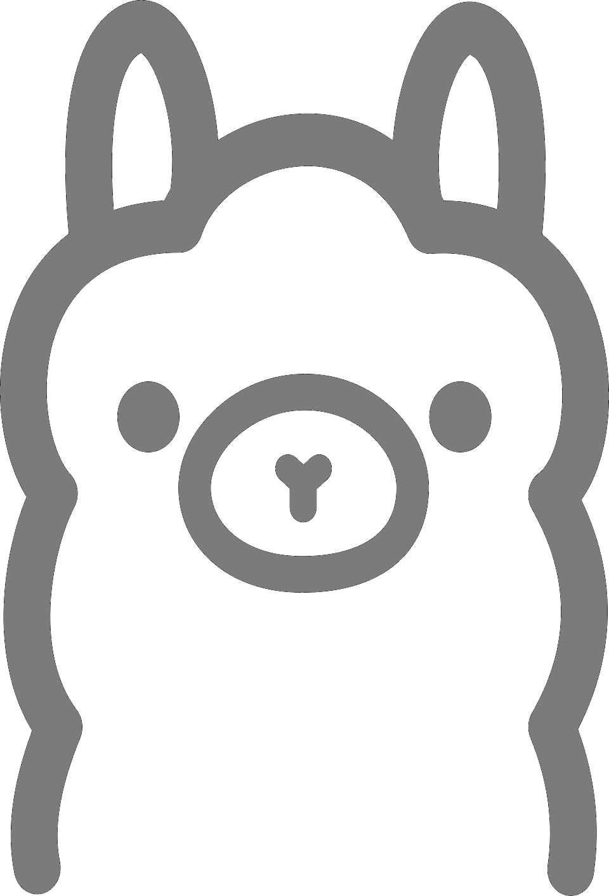

<div align="center">
  
</div>
<p align="center">
  <a href="https://deepvibe.eu/lamavibe">lamavibe.eu</a>
</p>

# LamaVibe

LamaVibe is the **Ollama build** of the _Vibe_ family — a fork of ZCode focused on a single provider: **Ollama** (local models). One model, one workspace, a partner — not an agent.

The _Vibe_ family ships one focused app per provider (DeepVibe for DeepSeek, KimiVibe for Kimi, LamaVibe for Ollama, MiniVibe for MiniMax, KlausVibe for Claude, …), each with its own character. It exists **alongside** ZCode, not instead of it: ZCode for the multi-provider workflow, the Vibe apps for people who want one model, one workspace, one partner. See the main source repository for the full codebase.

## Downloads

Installers for macOS, Windows and Linux are published under [Releases](../../releases). The built-in updater checks this repository.

## Building from source

Requires Git, Node.js **24.14.0** and pnpm **10.33.2** (see `mise.toml`).

```bash
pnpm bootstrap
# run the LamaVibe flavor in dev
pnpm dev:desktop:lama
# package (LamaVibe flavor)
ZCODE_LAMA_IDENTITY=1 pnpm bundle:desktop -- --os linux --arch x64
```

## License & attribution

Built on ZCode (Apache-2.0); the license and NOTICE are preserved. LamaVibe is an independent project and is not affiliated with ZCode/Z.ai or Ollama. Ollama is a trademark of its owner; the logo is used with the operator's permission.
